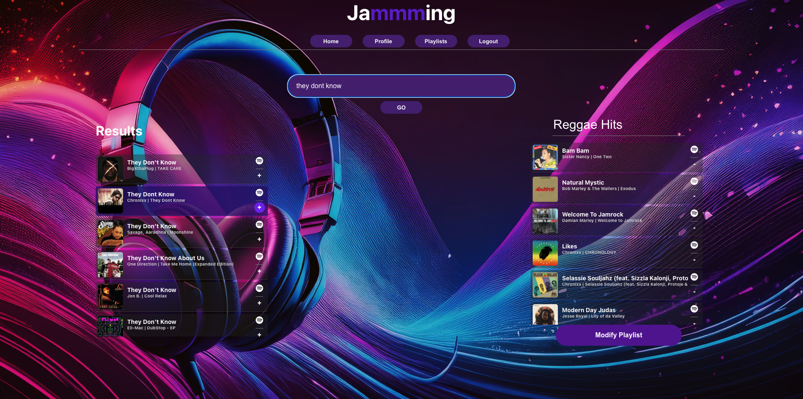

# Jammming React App

created by: Dalton R. Burton

## What is Jammming?

Jammming is an exciting music lovers application that offers users fast and fun creation and customization of their spotify music playlists! It was designed using spotifies API and reactjs.

## Application Architecture

Jammming web application is built on nodeJS and react and accesses the spotify API database.

## Built With


## Requirements
You need:
- Node.js (version v18.15.0 or later)
```
https://nodejs.org/en/download/package-manager
```
- npm 5.2+ and higher
```
npm install -g npm@latest
```

## Installation

Make a clone of this repository:

```
https://github.com/IamDal/jammming-app
```
Navigate to the root folder and run
```
npm start
```
To modify, You will need to create an app with Spotify for Web Developers in order to obtain your own client Id and client secret.
```
https://developer.spotify.com/
```
Once you obtain a client Id and client secret, you can update your .env file.

## How To Use

### Login

Once you click login, users will be redirected to Spotify's authentication page, once there enter mail address and password to gain access to the app.

### Creating a New Playlist
Jammming offers its endusers the ability to create new playlist, Just search for the song you're interested in and add it to the empty list, once submitted the playlist will be created in the users spotify account.

### Modifying Existing Playlist
Jammming also provides customization of existing playlists. users can add, remove and reorganize their paylist in whatever way they like. 

### Profile
It has a profile page that displays common user data.
